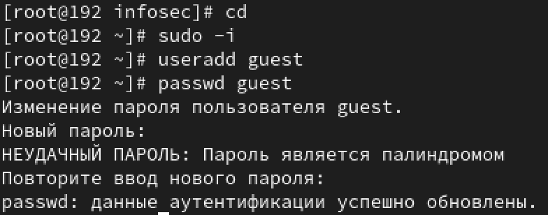
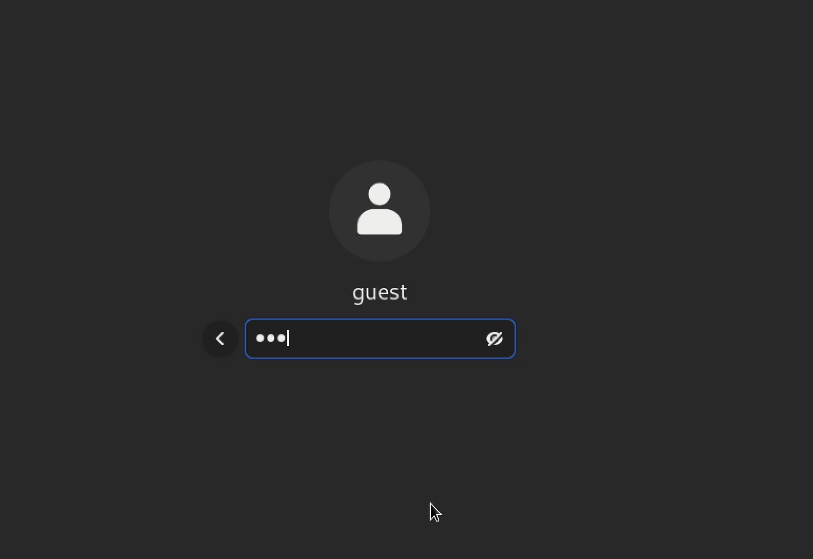
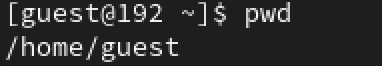
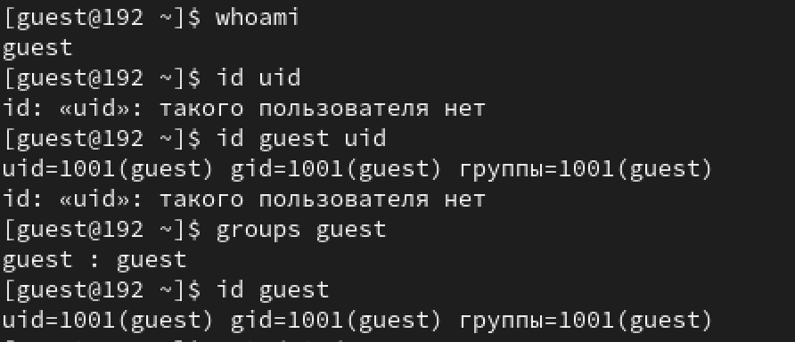
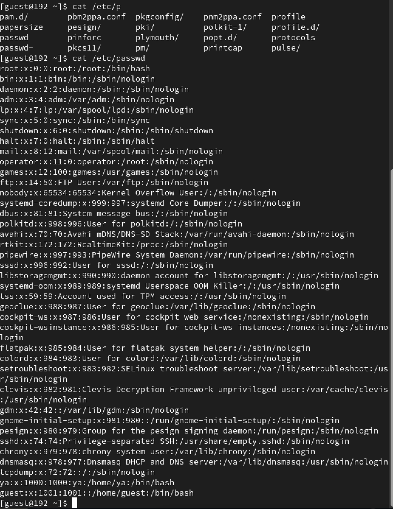
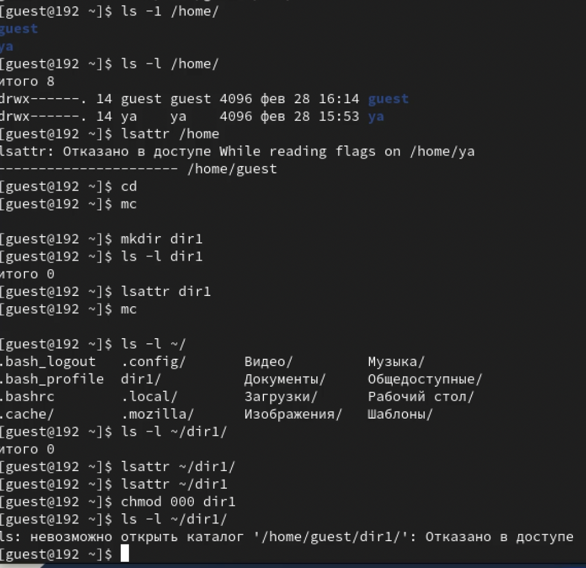
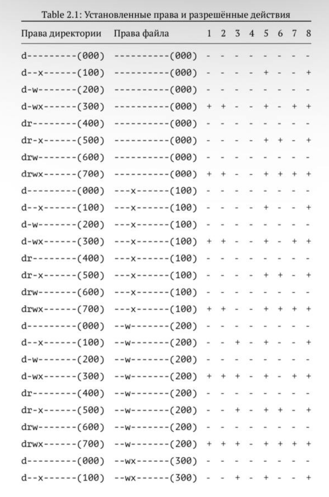
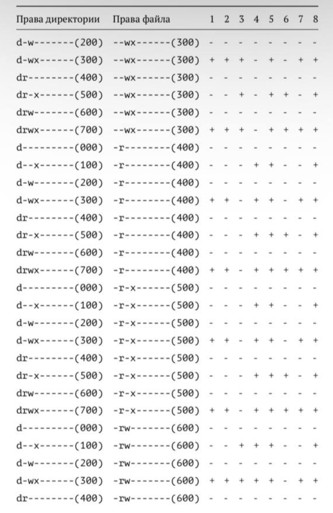
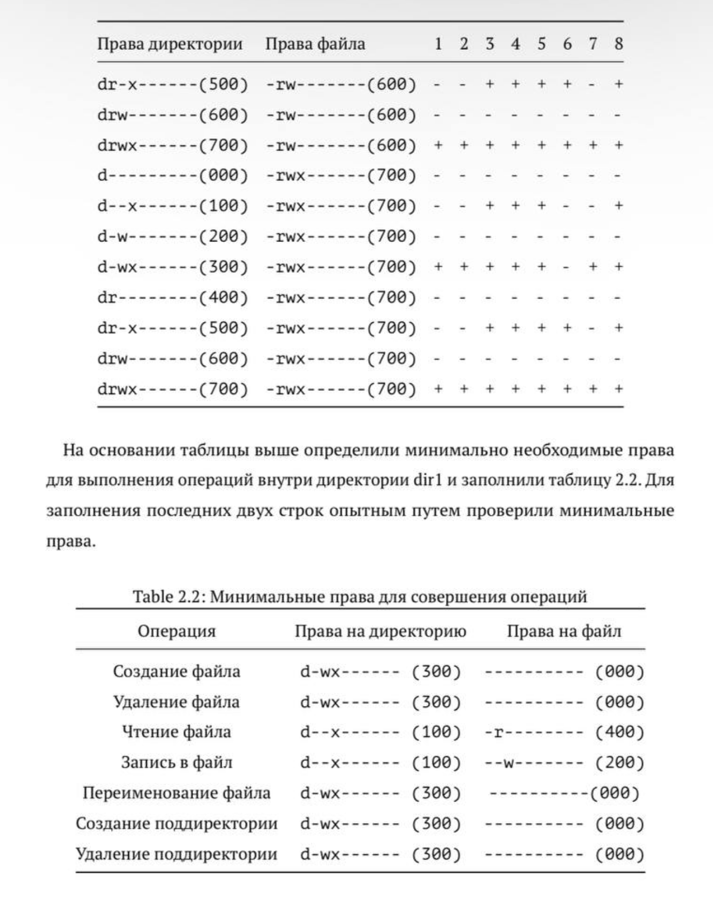

---
## Front matter
title: "Лабораторная работа-2"
subtitle: "Дискреционное разграничение прав в Linux. Основные атрибуты"
author: "Световидова Полина НБИбд-04-22"

## Generic otions
lang: ru-RU
toc-title: "Содержание"

## Bibliography
bibliography: bib/cite.bib
csl: pandoc/csl/gost-r-7-0-5-2008-numeric.csl

## Pdf output format
toc: true # Table of contents
toc-depth: 2
lof: true # List of figures
lot: true # List of tables
fontsize: 12pt
linestretch: 1.5
papersize: a4
documentclass: scrreprt
## I18n polyglossia
polyglossia-lang:
  name: russian
  options:
	- spelling=modern
	- babelshorthands=true
polyglossia-otherlangs:
  name: english
## I18n babel
babel-lang: russian
babel-otherlangs: english
## Fonts
mainfont: PT Serif
romanfont: PT Serif
sansfont: PT Sans
monofont: PT Mono
mainfontoptions: Ligatures=TeX
romanfontoptions: Ligatures=TeX
sansfontoptions: Ligatures=TeX,Scale=MatchLowercase
monofontoptions: Scale=MatchLowercase,Scale=0.9
## Biblatex
biblatex: true
biblio-style: "gost-numeric"
biblatexoptions:
  - parentracker=true
  - backend=biber
  - hyperref=auto
  - language=auto
  - autolang=other*
  - citestyle=gost-numeric
## Pandoc-crossref LaTeX customization
figureTitle: "Рис."
tableTitle: "Таблица"
listingTitle: "Листинг"
lofTitle: "Список иллюстраций"
lotTitle: "Список таблиц"
lolTitle: "Листинги"
## Misc options
indent: true
header-includes:
  - \usepackage{indentfirst}
  - \usepackage{float} # keep figures where there are in the text
  - \floatplacement{figure}{H} # keep figures where there are in the text
---

# Цель работы

Получение практических навыков работы в консоли с атрибутами фай- лов, закрепление теоретических основ дискреционного разграничения до- ступа в современных системах с открытым кодом на базе ОС Linux1.

# Выполнение лабораторной работы

1. 1. В установленной при выполнении предыдущей лабораторной работы
операционной системе создайте учётную запись пользователя guest (ис- пользую учётную запись администратора):
useradd guest
2. Задайте пароль для пользователя guest (использую учётную запись ад- министратора):
passwd guest
{ #fig:001 width=70% }
3. Войдите в систему от имени пользователя guest.
{ #fig:002 width=70% }
4. Определитедиректорию,вкоторойвынаходитесь,командой pwd.Срав-
ните её с приглашением командной строки. Определите, является ли она вашей домашней директорией? Если нет, зайдите в домашнюю директо- рию.
 { #fig:003 width=70% }
5. Уточните имя вашего пользователя командой whoami.
6. Уточнитеимявашегопользователя,егогруппу,атакжегруппы,кудавхо- дит пользователь, командой id. Выведенные значения uid, gid и др. за-
помните. Сравните вывод id с выводом команды groups.
7. Сравните полученную информацию об имени пользователя с данными,
выводимыми в приглашении командной строки.
{ #fig:004 width=70% }
8. Просмотритефайл/etc/passwdкомандой
  cat /etc/passwd
{ #fig:005 width=70% }
Найдите в нём свою учётную запись. Определите uid пользователя. Определите gid пользователя. Сравните найденные значения с получен- ными в предыдущих пунктах.
Замечание: в случае, когда вывод команды не умещается на одном экране монитора, используйте прокрутку вверх–вниз (удерживая клави- шу shift, нажимайте page up и page down) либо программу grep в
1При составлении работы использовались материалы [2—4].
 
Информационная безопасность компьютерных сетей 23
 качестве фильтра для вывода только строк, содержащих определённые буквенные сочетания:
cat /etc/passwd | grep guest
9. Определите существующие в системе директории командой
ls -l /home/
Удалось ли вам получить список поддиректорий директории /home? Ка- кие права установлены на директориях?
10. Проверьте, какие расширенные атрибуты установлены на поддиректо- риях, находящихся в директории /home, командой:
lsattr /home
Удалось ли вам увидеть расширенные атрибуты директории?
Удалось ли вам увидеть расширенные атрибуты директорий других
пользователей?
11. Создайтевдомашнейдиректорииподдиректориюdir1командой
mkdir dir1
Определите командами ls -l и lsattr, какие права доступа и расши- ренные атрибуты были выставлены на директорию dir1.
12. Снимитесдиректорииdir1всеатрибутыкомандой
chmod 000 dir1
и проверьте с её помощью правильность выполнения команды ls -l
13. Попытайтесьсоздатьвдиректорииdir1файлfile1командой
echo "test" > /home/guest/dir1/file1
Объясните, почему вы получили отказ в выполнении операции по созда- нию файла?
Оцените, как сообщение об ошибке отразилось на создании файла? Про- верьте командой
ls -l /home/guest/dir1
действительно ли файл file1 не находится внутри директории dir1.
{ #fig:006 width=70% }

14. Заполните таблицу «Установленные права и разрешённые действия» (см. табл. 2.1), выполняя действия от имени владельца директории (фай- лов), определив опытным путём, какие операции разрешены, а какие нет. Если операция разрешена, занесите в таблицу знак «+», если не разре- шена, знак «-».
Замечание 1: при заполнении табл. 2.1 рассматриваются не все атрибу- ты файлов и директорий, а лишь «первые три»: г, w, х, для «владельца». Остальные атрибуты также важны (особенно при использовании досту- па от имени разных пользователей, входящих в те или иные группы). Проверка всех атрибутов при всех условиях значительно увеличила бы таблицу: так 9 атрибутов на директорию и 9 атрибутов на файл дают 218 строк без учёта дополнительных атрибутов, плюс таблица была бы расширена по количеству столбцов, так как все приведённые операции необходимо было бы повторить ещё как минимум для двух пользовате- лей: входящего в группу владельца файла и не входящего в неё.
После полного заполнения табл. 2.1 и анализа полученных данных нам удалось бы выяснить, что заполнение её в таком виде излишне. Можно
{ #fig:007 width=70% }
{ #fig:008 width=70% }
15. разделить большую таблицу на несколько малых независимых таблиц. В данном примере предлагается рассмотреть 3 + 3 атрибута, т.е. 26 = 64
варианта.
Замечание 2: в ряде действий при выполнении команды удаления файла вы можете столкнуться с вопросом: «удалить защищённый от записи пу- стой обычный файл dir1/file1?» Обратите внимание, что наличие этого вопроса не позволяет сделать правильный вывод о том, что файл мож- но удалить. В ряде случаев, при ответе «y» (да) на указанный вопрос, возможно получить другое сообщение: «невозможно удалить dirl /file1: Отказано в доступе». Наоснованиизаполненнойтаблицыопределитетеилииныеминималь- но необходимые права для выполнения операций внутри директории dir1, заполните табл. 2.2.
а затем ищет в указанном файле нужные строки, определяемые ключом -p.
{ #fig:009 width=70% }
