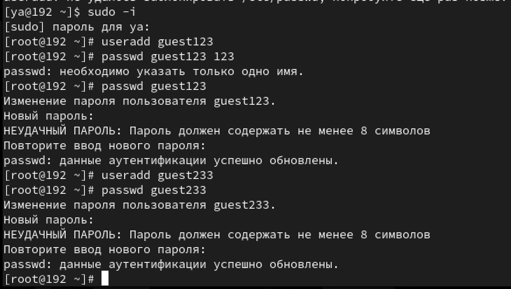
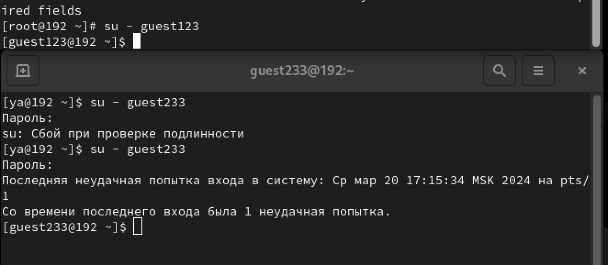
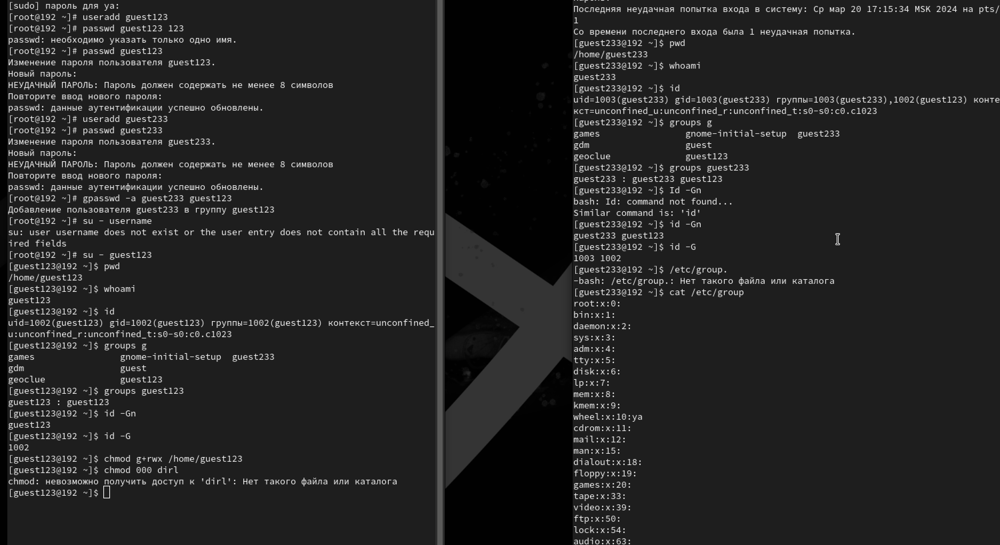
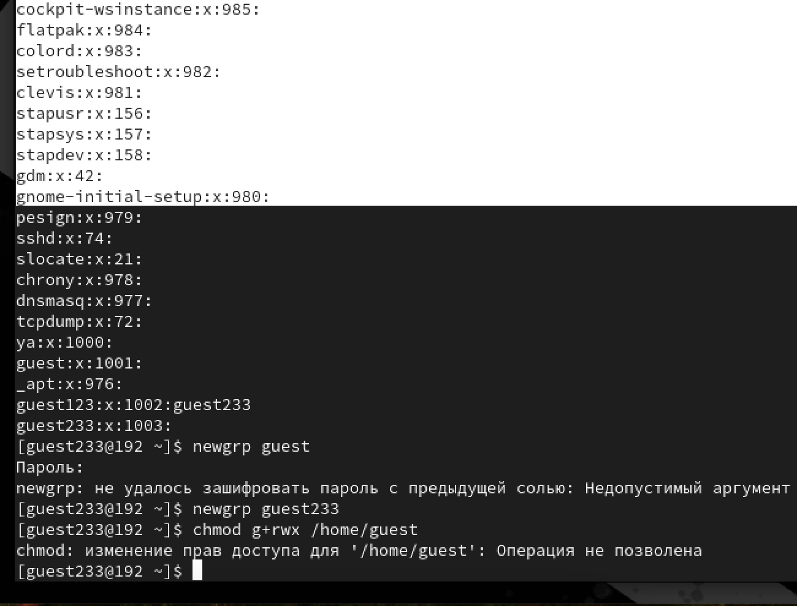

---
## Front matter
title: "Лабораторная работа-2"
subtitle: "Лабораторная работа No 3. Дискреционное разграничение прав в Linux. Два пользователя"
author: "Световидова Полина НБИбд-04-22"

## Generic otions
lang: ru-RU
toc-title: "Содержание"

## Bibliography
bibliography: bib/cite.bib
csl: pandoc/csl/gost-r-7-0-5-2008-numeric.csl

## Pdf output format
toc: true # Table of contents
toc-depth: 2
lof: true # List of figures
lot: true # List of tables
fontsize: 12pt
linestretch: 1.5
papersize: a4
documentclass: scrreprt
## I18n polyglossia
polyglossia-lang:
  name: russian
  options:
	- spelling=modern
	- babelshorthands=true
polyglossia-otherlangs:
  name: english
## I18n babel
babel-lang: russian
babel-otherlangs: english
## Fonts
mainfont: PT Serif
romanfont: PT Serif
sansfont: PT Sans
monofont: PT Mono
mainfontoptions: Ligatures=TeX
romanfontoptions: Ligatures=TeX
sansfontoptions: Ligatures=TeX,Scale=MatchLowercase
monofontoptions: Scale=MatchLowercase,Scale=0.9
## Biblatex
biblatex: true
biblio-style: "gost-numeric"
biblatexoptions:
  - parentracker=true
  - backend=biber
  - hyperref=auto
  - language=auto
  - autolang=other*
  - citestyle=gost-numeric
## Pandoc-crossref LaTeX customization
figureTitle: "Рис."
tableTitle: "Таблица"
listingTitle: "Листинг"
lofTitle: "Список иллюстраций"
lotTitle: "Список таблиц"
lolTitle: "Листинги"
## Misc options
indent: true
header-includes:
  - \usepackage{indentfirst}
  - \usepackage{float} # keep figures where there are in the text
  - \floatplacement{figure}{H} # keep figures where there are in the text
---

# Цель работы

Получение практических навыков работы в консоли с расширенными атрибутами файлов1.

# Выполнение лабораторной работы
1. От имени пользователя guest определите расширенные атрибуты файла /home/guest/dir1/file1 командой
lsattr /home/guest/dir1/file1
2. Установите командой
chmod 600 file1
на файл file1 права, разрешающие чтение и запись для владельца фай- ла.
3. Попробуйтеустановитьнафайл/home/guest/dir1/file1расширен- ный атрибут a от имени пользователя guest:
{ #fig:001 width=70% }
chattr +a /home/guest/dir1/file1
В ответ вы должны получить отказ от выполнения операции.
4. Зайдите на третью консоль с правами администратора либо повысьте свои права с помощью команды su. Попробуйте установить расширен- ный атрибут a на файл /home/guest/dir1/file1 от имени суперполь- зователя:
  chattr +a /home/guest/dir1/file1
  { #fig:002 width=70% }
5. От пользователя guest проверьте правильность установления атрибута:
  lsattr /home/guest/dir1/file1
6. Выполнитедозаписьвфайлfile1слова«test»командой
echo "test" /home/guest/dir1/file1
После этого выполните чтение файла file1 командой cat /home/guest/dir1/file1
Убедитесь, что слово test было успешно записано в file1. { #fig:001 width=70% }
7. Попробуйтеудалитьфайлfile1либостеретьимеющуюсявнёминфор- мацию командой
echo "abcd" > /home/guest/dirl/file1
Попробуйте переименовать файл.
8. Попробуйте с помощью команды { #fig:001 width=70% }
chmod 000 file1
установить на файл file1 права, например, запрещающие чтение и за- пись для владельца файла. Удалось ли вам успешно выполнить указан- ные команды? Снимитерасширенныйатрибутaсфайла/home/guest/dirl/file1от имени суперпользователя командой
chattr -a /home/guest/dir1/file1
Повторите операции, которые вам ранее не удавалось выполнить. Ваши наблюдения занесите в отчёт. Повторитевашидействияпошагам,замениватрибут«a»атрибутом«i». Удалось ли вам дозаписать информацию в файл? Ваши наблюдения за- несите в отчёт.
В результате выполнения работы вы повысили свои навыки использова- ния интерфейса командой строки (CLI), познакомились на примерах с тем, как используются основные и расширенные атрибуты при разграничении доступа. Имели возможность связать теорию дискреционного разделения доступа (дискреционная политика безопасности) с её реализацией на прак- тике в ОС Linux. Составили наглядные таблицы, поясняющие какие опера- ции возможны при тех или иных установленных правах. Опробовали дей- ствие на практике расширенных атрибутов «а» и «i».

