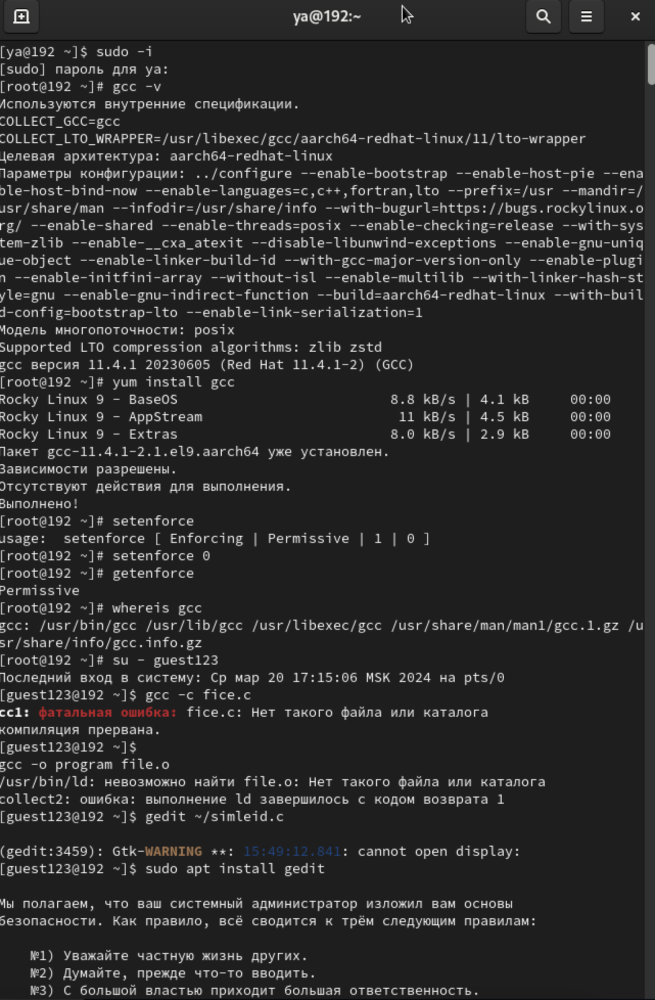
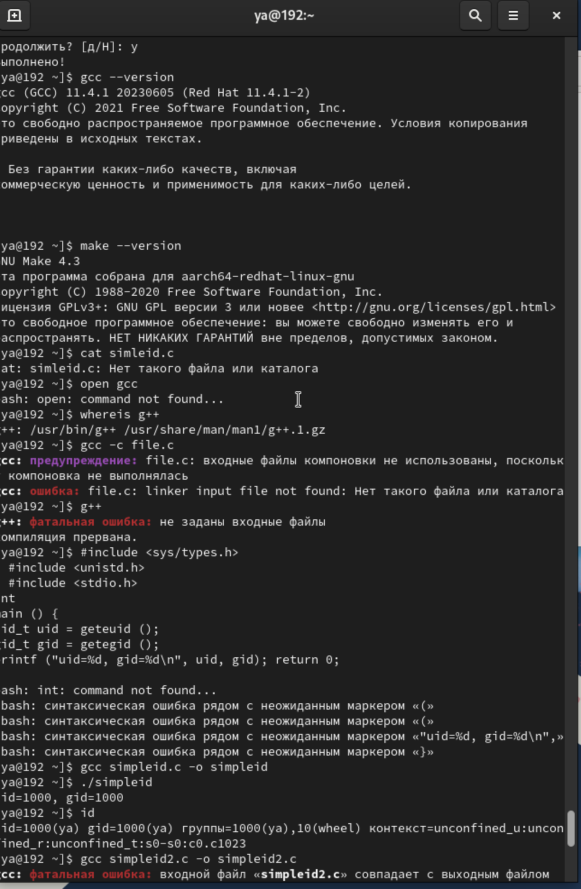
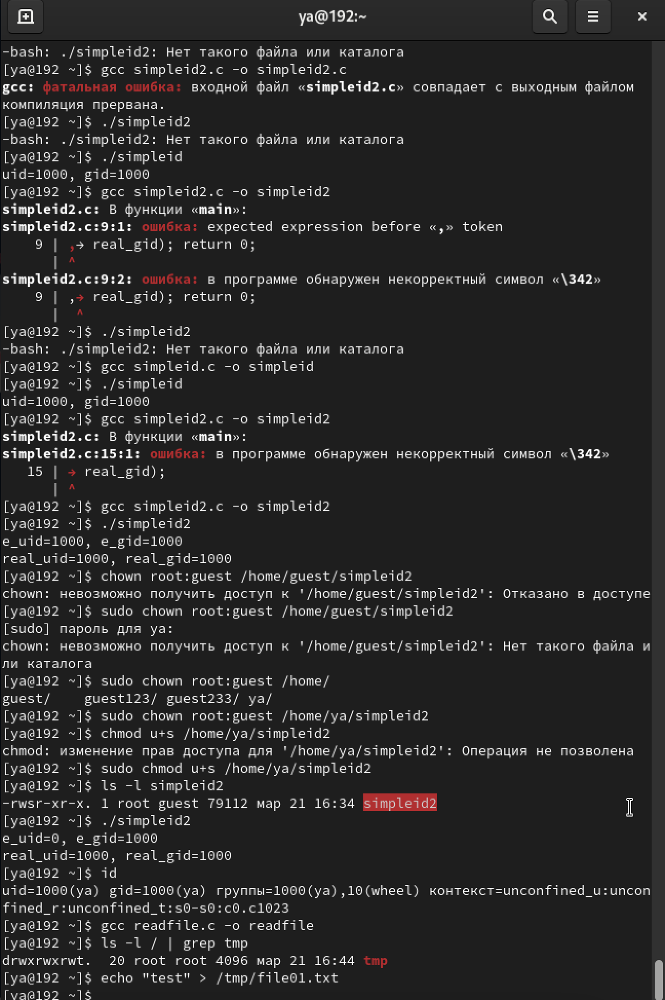

---
## Front matter
title: "Лабораторная работа-5"
subtitle: "Лабораторная работа No 5. Дискреционное разграничение прав в Linux. Исследование влияния дополнительных атрибутов"
author: "Световидова Полина НБИбд-04-22"

## Generic otions
lang: ru-RU
toc-title: "Содержание"

## Bibliography
bibliography: bib/cite.bib
csl: pandoc/csl/gost-r-7-0-5-2008-numeric.csl

## Pdf output format
toc: true # Table of contents
toc-depth: 2
lof: true # List of figures
lot: true # List of tables
fontsize: 12pt
linestretch: 1.5
papersize: a4
documentclass: scrreprt
## I18n polyglossia
polyglossia-lang:
  name: russian
  options:
	- spelling=modern
	- babelshorthands=true
polyglossia-otherlangs:
  name: english
## I18n babel
babel-lang: russian
babel-otherlangs: english
## Fonts
mainfont: PT Serif
romanfont: PT Serif
sansfont: PT Sans
monofont: PT Mono
mainfontoptions: Ligatures=TeX
romanfontoptions: Ligatures=TeX
sansfontoptions: Ligatures=TeX,Scale=MatchLowercase
monofontoptions: Scale=MatchLowercase,Scale=0.9
## Biblatex
biblatex: true
biblio-style: "gost-numeric"
biblatexoptions:
  - parentracker=true
  - backend=biber
  - hyperref=auto
  - language=auto
  - autolang=other*
  - citestyle=gost-numeric
## Pandoc-crossref LaTeX customization
figureTitle: "Рис."
tableTitle: "Таблица"
listingTitle: "Листинг"
lofTitle: "Список иллюстраций"
lotTitle: "Список таблиц"
lolTitle: "Листинги"
## Misc options
indent: true
header-includes:
  - \usepackage{indentfirst}
  - \usepackage{float} # keep figures where there are in the text
  - \floatplacement{figure}{H} # keep figures where there are in the text
---

# Цель работы

Изучение механизмов изменения идентификаторов, применения SetUID- и Sticky-битов. Получение практических навыков работы в кон- соли с дополнительными атрибутами. Рассмотрение работы механизма смены идентификатора процессов пользователей, а также влияние бита Sticky на запись и удаление файлов.1.

# Выполнение лабораторной работы

Создание программы
1. Войдите в систему от имени пользователя guest. 2. Создайте программу simpleid.c:
36 Кулябов Д. С., Королькова А. В., Геворкян М. Н.
   #include <sys/types.h>
  #include <unistd.h>
  #include <stdio.h>
int
main () {
uid_t uid = geteuid ();
gid_t gid = getegid ();
printf ("uid=%d, gid=%d\n", uid, gid); return 0;
}
3. Скомплилируйте программу и убедитесь, что файл программы создан:
  gcc simpleid.c -o simpleid
4. Выполните программу simpleid:
./simpleid
5. Выполните системную программу id:
id
и сравните полученный вами результат с данными предыдущего пункта
задания. { #fig:001 width=70% }
6. Усложните программу, добавив вывод действительных идентификато-
ров:
  #include <sys/types.h>
  #include <unistd.h>
  #include <stdio.h>
int
main () {
uid_t real_uid = getuid (); uid_t e_uid = geteuid ();
gid_t real_gid = getgid (); gid_t e_gid = getegid () ;
printf ("e_uid=%d, e_gid=%d\n", e_uid, e_gid); printf ("real_uid=%d, real_gid=%d\n", real_uid,
,→ real_gid); return 0;
}
Получившуюся программу назовите simpleid2.c.
7. Скомпилируйте и запустите simpleid2.c:
  gcc simpleid2.c -o simpleid2
./simpleid2
8. От имени суперпользователя выполните команды:

Информационная безопасность компьютерных сетей 37
    chown root:guest /home/guest/simpleid2
   chmod u+s /home/guest/simpleid2
9. Используйте sudo или повысьте временно свои права с помощью su.
Поясните, что делают эти команды.
10. Выполнитепроверкуправильностиустановкиновыхатрибутовисмены
владельца файла simpleid2:
   ls -l simpleid2
11. Запустите simpleid2 и id:
./simpleid2
id
Сравните результаты.
12. Проделайте тоже самое относительно SetGID-бита.
13. Создайте программу readfile.c:
    #include <fcntl.h>
    #include <stdio.h>
    #include <sys/stat.h>
    #include <sys/types.h>
    #include <unistd.h>
int
main (int argc, char* argv[]) {
unsigned char buffer[16]; size_t bytes_read;
int i;
int fd = open (argv[1], O_RDONLY); do
{
bytes_read = read (fd, buffer, sizeof (buffer));
for (i =0; i < bytes_read; ++i) printf("%c", buffer[i]); }
while (bytes_read == sizeof (buffer)); close (fd);
return 0;
}
14. Откомпилируйте её.
   gcc readfile.c -o readfile { #fig:001 width=70% }
15. Смените владельца у файла readfile.c (или любого другого текстового файла в системе) и измените права так, чтобы только суперпользователь (root) мог прочитать его, a guest не мог.
16. Проверьте, что пользователь guest не может прочитать файл readfile.c.
17. Смените у программы readfile владельца и установите SetU’D-бит.
18. Проверьте, может ли программа readfile прочитать файл readfile.c?
19. Проверьте, может ли программа readfile прочитать файл /etc/shadow?
Отразите полученный результат и ваши объяснения в отчёте.

38 Кулябов Д. С., Королькова А. В., Геворкян М. Н.
 5.3.2. Исследование Sticky-бита
1. Выясните, установлен ли атрибут Sticky на директории /tmp, для чего выполните команду
ls -l / | grep tmp
2. Отименипользователяguestсоздайтефайлfile01.txtвдиректории/tmp со словом test:
echo "test" > /tmp/file01.txt
3. Просмотрите атрибуты у только что созданного файла и разрешите чте- ние и запись для категории пользователей «все остальные»:
ls -l /tmp/file01.txt
chmod o+rw /tmp/file01.txt
   ls -l /tmp/file01.txt
4. От пользователя guest2 (не являющегося владельцем) попробуйте про- читать файл /tmp/file01.txt:
cat /tmp/file01.txt
5. От пользователя guest2 попробуйте дозаписать в файл /tmp/file01.txt слово test2 командой
echo "test2" > /tmp/file01.txt
Удалось ли вам выполнить операцию?
6. Проверьте содержимое файла командой
   cat /tmp/file01.txt
7. От пользователя guest2 попробуйте записать в файл /tmp/file01.txt
слово test3, стерев при этом всю имеющуюся в файле информацию ко- мандой
echo "test3" > /tmp/file01.txt
Удалось ли вам выполнить операцию?
8. Проверьте содержимое файла командой
   cat /tmp/file01.txt
9. Отпользователяguest2попробуйтеудалитьфайл/tmp/file01.txtко-
мандой
    rm /tmp/fileOl.txt
Удалось ли вам удалить файл?
10. Повысьте свои права до суперпользователя следующей командой
su -
и выполните после этого команду, снимающую атрибут t (Sticky-бит) с директории /tmp:
chmod -t /tmp
11. Покиньте режим суперпользователя командой
exit
12. От пользователя guest2 проверьте, что атрибута t у директории /tmp
нет:
   ls -l / | grep tmp
13. Повторите предыдущие шаги. Какие наблюдаются изменения?
14. Удалось ли вам удалить файл от имени пользователя, не являющегося
его владельцем? Ваши наблюдения занесите в отчёт.

Информационная безопасность компьютерных сетей 39
 15. Повысьте свои права до суперпользователя и верните атрибут t на ди- ректорию /tmp:
   su -
   chmod +t /tmp
   exit
5.4. Содержание отчёта
Отчёт должен включать:
1. титульный лист;
2. формулировку цели работы;
3. описание процесса выполнения задания. Для каждого действия, произ-
водимого в командной строке, в отчёт следует включить: – краткое описание действия;
– вводимая команда или команды;
– результаты выполнения команд (снимок экрана);
4. листинг программы; { #fig:001 width=70% }
5. выводы, согласованные с целью работы.