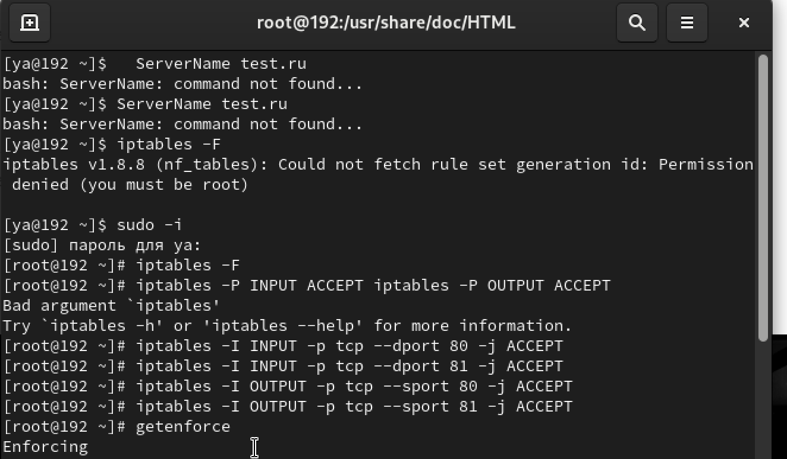
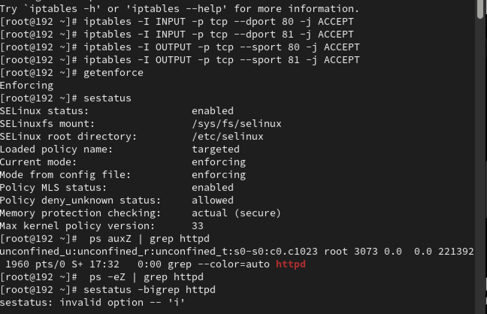
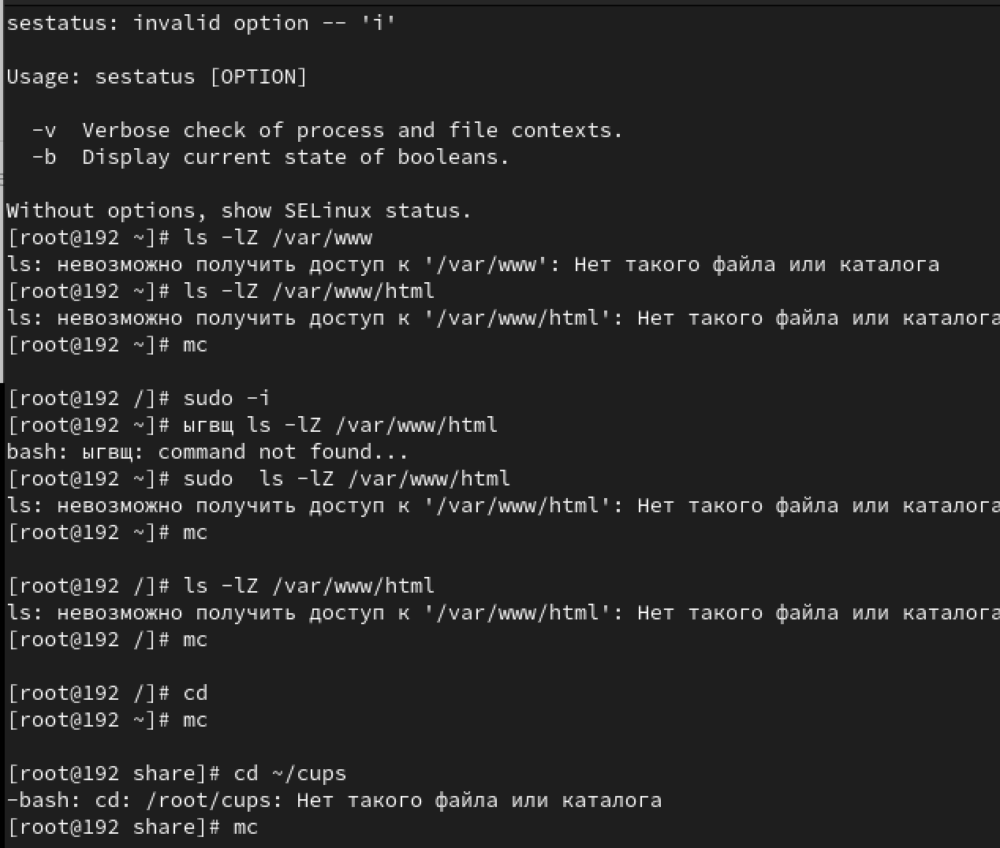
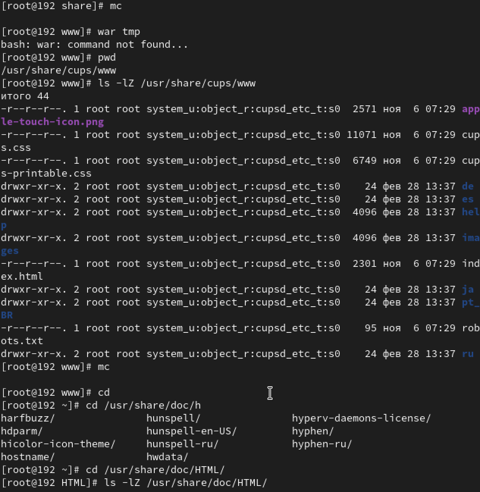
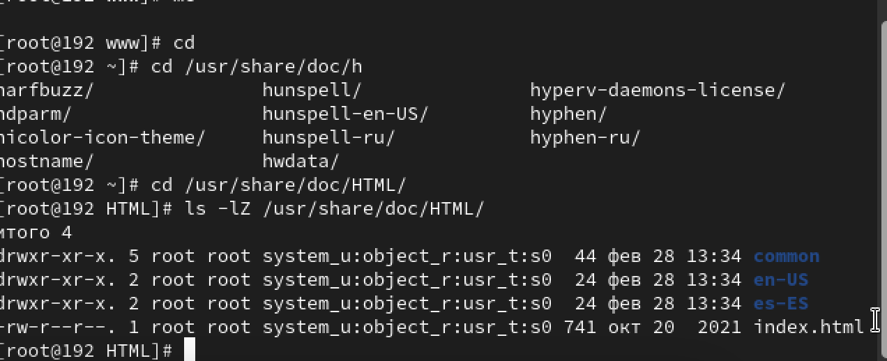

---
## Front matter
title: "Лабораторная работа-6"
subtitle: "Лабораторная работа No 6. Мандатное разграничение прав в Linux"
author: "Световидова Полина НБИбд-04-22"

## Generic otions
lang: ru-RU
toc-title: "Содержание"

## Bibliography
bibliography: bib/cite.bib
csl: pandoc/csl/gost-r-7-0-5-2008-numeric.csl

## Pdf output format
toc: true # Table of contents
toc-depth: 2
lof: true # List of figures
lot: true # List of tables
fontsize: 12pt
linestretch: 1.5
papersize: a4
documentclass: scrreprt
## I18n polyglossia
polyglossia-lang:
  name: russian
  options:
	- spelling=modern
	- babelshorthands=true
polyglossia-otherlangs:
  name: english
## I18n babel
babel-lang: russian
babel-otherlangs: english
## Fonts
mainfont: PT Serif
romanfont: PT Serif
sansfont: PT Sans
monofont: PT Mono
mainfontoptions: Ligatures=TeX
romanfontoptions: Ligatures=TeX
sansfontoptions: Ligatures=TeX,Scale=MatchLowercase
monofontoptions: Scale=MatchLowercase,Scale=0.9
## Biblatex
biblatex: true
biblio-style: "gost-numeric"
biblatexoptions:
  - parentracker=true
  - backend=biber
  - hyperref=auto
  - language=auto
  - autolang=other*
  - citestyle=gost-numeric
## Pandoc-crossref LaTeX customization
figureTitle: "Рис."
tableTitle: "Таблица"
listingTitle: "Листинг"
lofTitle: "Список иллюстраций"
lotTitle: "Список таблиц"
lolTitle: "Листинги"
## Misc options
indent: true
header-includes:
  - \usepackage{indentfirst}
  - \usepackage{float} # keep figures where there are in the text
  - \floatplacement{figure}{H} # keep figures where there are in the text
---

# Цель работы

Развить навыки администрирования ОС Linux. Получить первое прак- тическое знакомство с технологией SELinux1.
Проверить работу SELinx на практике совместно с веб-сервером Apache.

# Выполнение лабораторной работы

1. Войдите в систему с полученными учётными данными и убедитесь, что SELinux работает в режиме enforcing политики targeted с помощью ко- манд getenforce и sestatus. { #fig:001 width=70% }
2. Обратитесь с помощью браузера к веб-серверу, запущенному на вашем компьютере, и убедитесь, что последний работает:
service httpd status
или 
  /etc/rc.d/init.d/httpd status
Если не работает, запустите его так же, но с параметром start.
3. Найдитевеб-серверApacheвспискепроцессов,определитеегоконтекст безопасности и занесите эту информацию в отчёт. Например, можно ис-
пользовать команду
  ps auxZ | grep httpd
или
  ps -eZ | grep httpd
4. Посмотрите текущее состояние переключателей SELinux для Apache с помощью команды
sestatus -bigrep httpd
Обратите внимание, что многие из них находятся в положении «off». { #fig:001 width=70% }
42 Кулябов Д. С., Королькова А. В., Геворкян М. Н.
 5. Посмотритестатистикупополитикеспомощьюкомандыseinfo,также определите множество пользователей, ролей, типов.
6. Определите тип файлов и поддиректорий, находящихся в директории /var/www, с помощью команды{ #fig:001 width=70% }
ls -lZ /var/www
7. Определите тип файлов, находящихся в директории /var/www/html: ls -lZ /var/www/html
8. Определите круг пользователей, которым разрешено создание файлов в директории /var/www/html.
9. Создайте от имени суперпользователя (так как в дистрибутиве по- сле установки только ему разрешена запись в директорию) html-файл /var/www/html/test.html следующего содержания:
<html>
<body>test</body>
</html> { #fig:001 width=70% }
10. Проверьте контекст созданного вами файла. Занесите в отчёт контекст, присваиваемый по умолчанию вновь созданным файлам в директории /var/www/html.
11. Обратитесь к файлу через веб-сервер, введя в браузере адрес http://127.0.0.1/test.html. Убедитесь, что файл был успеш- но отображён.
12. Изучите справку man httpd_selinux и выясните, какие контек- сты файлов определены для httpd. Сопоставьте их с типом файла test.html. Проверить контекст файла можно командой ls -Z.
ls -Z /var/www/html/test.html
Рассмотрим полученный контекст детально. Обратите внимание, что так как по умолчанию пользователи CentOS являются свободными от типа (unconfined в переводе с англ. означает свободный), созданному нами файлу test.html был сопоставлен SELinux, пользователь unconfined_u. Это первая часть контекста.
Далее политика ролевого разделения доступа RBAC используется про- цессами, но не файлами, поэтому роли не имеют никакого значения для файлов. Роль object_r используется по умолчанию для файлов на «по- стоянных» носителях и на сетевых файловых системах. (В директории /ргос файлы, относящиеся к процессам, могут иметь роль system_r. Если активна политика MLS, то могут использоваться и другие роли, например, secadm_r. Данный случай мы рассматривать не будем, как и предназначение :s0).
Тип httpd_sys_content_t позволяет процессу httpd получить доступ к фай- лу. Благодаря наличию последнего типа мы получили доступ к файлу при обращении к нему через браузер.
13. Измените контекст файла /var/www/html/test.html с httpd_sys_content_t на любой другой, к которому процесс httpd не должен иметь доступа, например, на samba_share_t:
chcon -t samba_share_t /var/www/html/test.html
   ls -Z /var/www/html/test.html

Информационная безопасность компьютерных сетей 43
 После этого проверьте, что контекст поменялся.
14. Попробуйте ещё раз получить доступ к файлу через веб-сервер, введя в
браузере адрес http://127.0.0.1/test.html. Вы должны получить сообщение об ошибке:
Forbidden
You don't have permission to access /test.html on this server.
15. Проанализируйтеситуацию.Почемуфайлнебылотображён,еслиправа доступа позволяют читать этот файл любому пользователю?
ls -l /var/www/html/test.html
Просмотрите log-файлы веб-сервера Apache. Также просмотрите си- стемный лог-файл:
   tail /var/log/messages
Если в системе окажутся запущенными процессы setroubleshootd и audtd, то вы также сможете увидеть ошибки, аналогичные указанным выше, в файле /var/log/audit/audit.log. Проверьте это утвержде- ние самостоятельно.
16. Попробуйте запустить веб-сервер Apache на прослушивание ТСР-порта 81 (а не 80, как рекомендует IANA и прописано в /etc/services). Для этого в файле /etc/httpd/httpd.conf найдите строчку Listen 80 и замените её на Listen 81.
17. Выполните перезапуск веб-сервера Apache. Произошёл сбой? Поясните почему?
18. Проанализируйте лог-файлы:
tail -nl /var/log/messages
Просмотрите файлы /var/log/http/error_log, /var/log/http/access_log и /var/log/audit/audit.log и выясните, в каких файлах появились записи.
19. Выполните команду
   semanage port -a -t http_port_t -р tcp 81
После этого проверьте список портов командой
   semanage port -l | grep http_port_t
Убедитесь, что порт 81 появился в списке.
20. Попробуйтезапуститьвеб-серверApacheещёраз.Понялиливы,почему
он сейчас запустился, а в предыдущем случае не смог?
21. Вернитеконтекстhttpd_sys_cоntent__tкфайлу/var/www/html/test.html:
   chcon -t httpd_sys_content_t /var/www/html/test.html
После этого попробуйте получить доступ к файлу через веб-сервер, вве- дя в браузере адрес http://127.0.0.1:81/test.html.
Вы должны увидеть содержимое файла — слово «test».
22. Исправьтеобратноконфигурационныйфайлapache,вернувListen80.
23. Удалите привязку http_port_t к 81 порту:
   semanage port -d -t http_port_t -p tcp 81
и проверьте, что порт 81 удалён.
24. Удалитефайл/var/www/html/test.html:
   rm /var/www/html/test.html
   
  { #fig:001 width=70% }